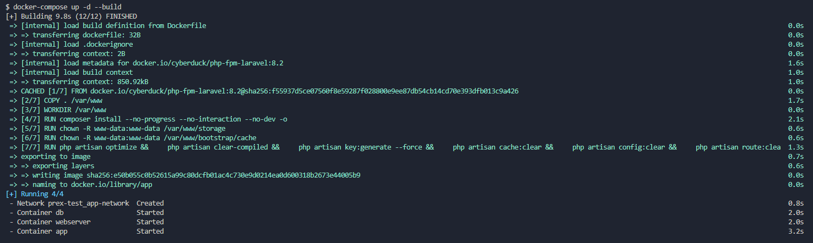
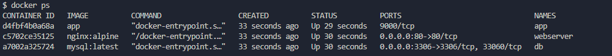
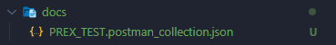

# PREX TEST

Este es un repositorio de prueba para PREX, el mismo esta generado con PHP 8.2, Laravel 10, Nginx y MySQL. 

## Despliegue

1. Debes tener instalado un entorno de Docker. Puede ser [Docker Desktop](https://www.docker.com/products/docker-desktop/) o [Docker Compose](https://docs.docker.com/compose/).

2. Sitúate en la raíz del proyecto.

3. Ejecuta el comando:

```bash
docker-compose up -d --build
```



Listo, ya deberías tener el contenedor activo. Puedes asegurarte ejecutando el comando:

```bash
docker ps
```


Deberías ver algo similar a la captura proporcionada.

## Documentación

Encontrarás una colección para importar a [Postman](https://www.postman.com/) en /docs, allí encontrarás la documentación de los servicios disponibles.


